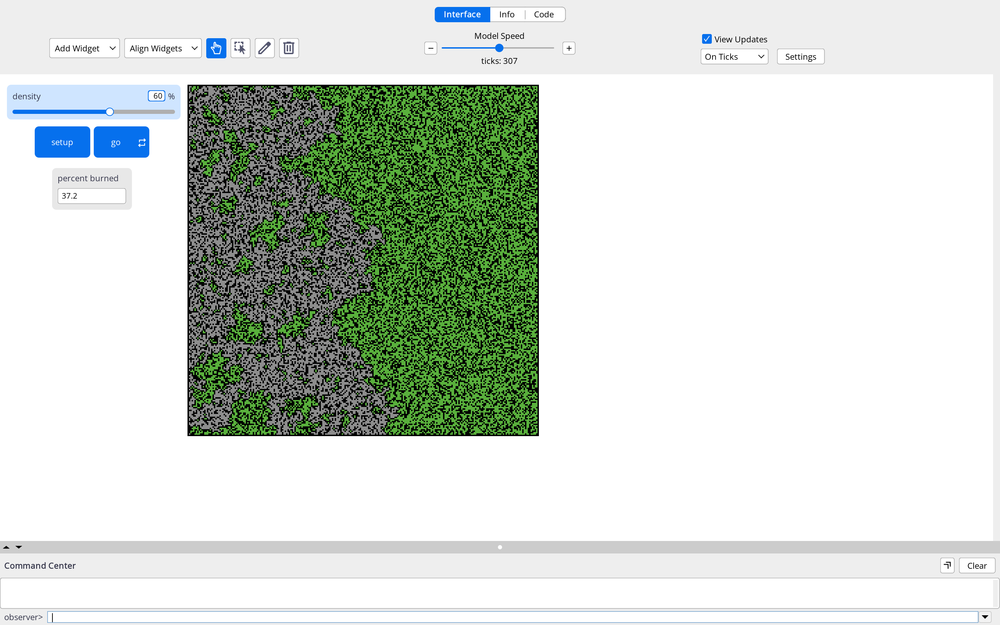

<!--
============================================================
ENVSCI 704 Assignment 2 template (fire-spread lab, Chapter 3.4)
============================================================
How to use this file:

1. In your GitHub course repo, create the folder `Assignment2/`
   and save this file there as `fire-spread.qmd`.
2. Fill in the YAML header above (your name and student ID).
3. Work through Parts A to C below. Every task needs code or a
   screenshot AND a short written answer.
4. Save screenshots as .png files in an `images/` folder next to
   this file (macOS: Cmd+Shift+4, Windows: Snipping Tool), then
   embed them like this:
       {width=70%}
5. Commit and push the .qmd AND the images/ folder, then paste
   the link on Canvas.

Tips:
- NetLogo code goes in netlogo-fenced code blocks, not Python cells.
- Give every screenshot a caption so the reader knows what it shows.
- If you build your Part B table in Excel, convert it with
  https://tabletomarkdown.com/convert-spreadsheet-to-markdown/
============================================================
-->

## Part A: Build the model

Paste your complete NetLogo code (the `globals`, `setup`, and `go` procedures):

```netlogo
globals [
  initial-trees
  burned-trees
]

to setup
  clear-all
  ask patches [
    if random 100 < density [ set pcolor green ]
  ]
  ask patches with [ pxcor = min-pxcor ] [
    if pcolor = green [ set pcolor red ]
  ]
  set initial-trees count patches with [ pcolor = green or pcolor = red ]
  set burned-trees 0
  reset-ticks
end

to go
  if not any? patches with [ pcolor = red ] [ stop ]
  ask patches with [ pcolor = red ] [
    ask neighbors4 with [ pcolor = green ] [
      set pcolor red
    ]
    set pcolor grey
    set burned-trees burned-trees + 1
  ]
  tick
end
```

**Task A1.** Embed your screenshot of the final state of the world at `density = 60`:



**Task A2.** Percent burned at the end of the run: 37.2

## Part B: Find the critical density

**Task B1.** Complete the table: ten runs at each density, percent burned each time.

| Density | Run 1 | Run 2 | Run 3 | Run 4 | Run 5 | Run 6 | Run 7 | Run 8 | Run 9 | Run 10 | Mean |
|--------:|------:|------:|------:|------:|------:|------:|------:|------:|------:|-------:|-----:|
| 40      | 1.1   |1.4    |1     |1.2    |1      |  0.9  | 1.3   |1.2    |1.2    | 1.3    | 1.16 |
| 50      |2.4    |2.3 |2.9    |2.9  |2.8   |1.9   |1.6  |2.3    |2.3    |3.4     |2.48 |
| 55      |3.4 |4.8 |3 |7.2 |4.5 |3.7 |6.2 |4.2 |6.2 |6.5 |4.78|
| 58      |5.4 |10.3 |18.1 |8.5 |24.1 |10.3|36.8 |13.5 |11.2 |16.3|14.91|
| 59      |20.5 |28.5 |55.8 |21.5 |70.7|35.5|46.7 |41.4 |19.4|22|36.2|
| 60      |16.4 |73.6|68.7|39.2 |77.8 |73.3|66.9|77.6| 77.2| 64.3|63.41|
| 62      |75.7 |88.1|87.3 |89|84.6|85.3 |84.8|87.1 |90.5|87.2 |86|
| 65      |86.5 |94.1 |93.8 |93.3 |94 |95.2 |94.2 |95.5 |94.5 |94.9| 93.6|
| 70      |95| 98|98 |97 |98.2 |96.5 |98 |97 |98 |98.6 |97.42|
| 80      |98.2 |99.8 |98.7 |99 |98.6 |99.8 |99.8 |99.7 |99.7 |99.6 | 99.27|


**Task B2.** Plot mean percent burned vs density. By hand or Excel: embed a photo or screenshot. In Python: use the code cell below.

```{python}
#| eval: True
import matplotlib.pyplot as plt

density = [40, 50, 55, 58, 59, 60, 62, 65, 70, 80]
mean_burned = [1.16, 2.37, 4.78, 14.91, 39, 63.41, 86, 93.6, 97.42, 99.27]  # fill in your means

fig, ax = plt.subplots(figsize=(6, 4))
ax.plot(density, mean_burned, marker="o")
ax.set_xlabel("Density (%)")
ax.set_ylabel("Mean percent burned (%)")
ax.set_title("Percent burned vs tree density")
plt.show()
```

**Task B3 (critical-density estimate).** 

From the graph produced, I estimate the critical density is around a similar range of 58 to 59. This is because the initial vertical jump occures around those values.

**Task B4 (variability near the threshold).** 
The values vary significantly. Within 40 and 80, the values of the run often linger around similar values, when sometimes they produce the same nuumber, wehreas at the critical value, there are values which are almost double indiffernece, where the highest value we saw was 70, and the lowest being 19


## Part C: Summary ODD documentation

Replace each `<...>` placeholder with your own text about the fire model. Keep the **bold** phrases as they are and keep ODD's key words in *italics*. Aim for one short paragraph per element. 

**The overall *purpose* of our model is** to look at the critical desity where the fires can become lethal, and have a large scale impact. This is because the density of the forest can influence the spped and magnitude of the spread of fire. **Specifically, we are addressing the following questions:** How does the density of the forest influence the spread of the fire? and what is the % of density where there would be a disproportionate impact on the forest. **To consider our model realistic enough for its purpose, we use the following *patterns*:** at lower densities, the fires should spread less quickly due to the space inbetween the trees. Whereas within higher densities, because the trees are much closer, the fire should interact and spread to thier neighbouring trees

**The model includes the following *entities*:** green patches, which represent the trees, black patches which represent areas with no trees, red patches which represnt fire, and grey patches which represent ashes. **The *state variables* characterising these entities are listed in Table 1.** **The *spatial* and *temporal* resolution and extent are** the model world which consists of grids which represent the 4 entities such as forest, no forest, fire and ash. One tick represents one timestamp of time passing by, and the run begins with the fire igniting on the left hand side of the netlogo, and ends when there are no fires left

**The most important *processes* of the model, which are repeated every *time step*, are** the burning patches, which interact with 4 neighbouring patches using the neighbours4. The burning trees are then burnt out which turns them grey. This repeats untiil there are no fires left

**The most important *design concepts* of the model are** the spatial interaction as it represnts the fire spreading only between adjacent patches using neighbors4. The threshold nbehaviour is also important as it it tree density eventually makes it more likely that more treese are going to spread

**The model is initialized with** first clearing all, which randomly distributes the forest depending on the density slider, and then the trees on the left hand side are ignited which changes the colour from green to red as it burns


**Table 1.** Entities and state variables of the model.

| Entity | Variable | Description | Possible values | Units |
|--------|----------|-------------|-----------------|-------|
| Patch  | `pcolor` |   is the current state of the patch      |      green, red, grey, or black           |  none     |
| Global | `density`|   controls the % of forest within the netlogo square         |      0-100           |    %   |
| initial trees|   `initial-trees`    | amount of trees at the start of the simulation           |    0-number of patch             |    tree   |

