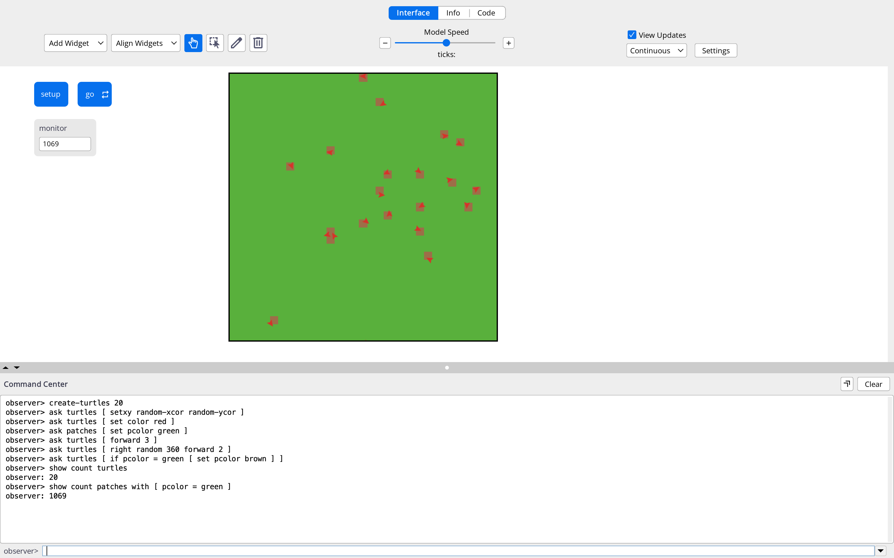
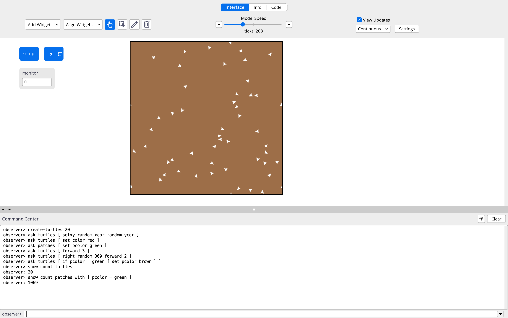
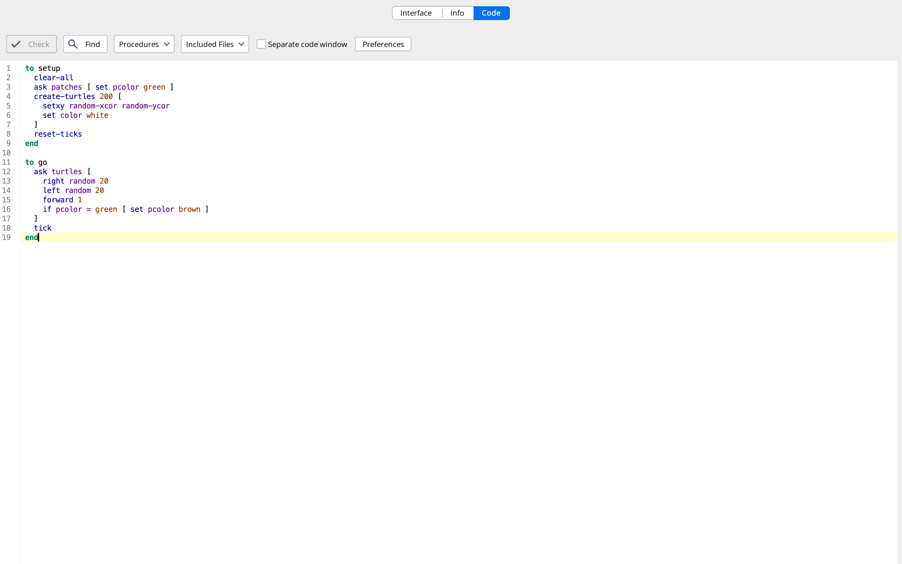

<!--
============================================================
ENVSCI 704 lab template (Week 3: agent-based modelling)
============================================================
How to use this file:

1. Copy it into your GitHub course repo and rename it, e.g.
   `lab-03-fire-spread.qmd`.
2. Fill in the YAML header above (title, your name, student ID).
3. Work through the tasks below. Delete any sections you do not need.
4. Render to PDF:
       quarto render lab-03-topic.qmd --to pdf
5. Commit and push the .qmd, the rendered .pdf, AND your images/
   folder. Submit the link to the PDF on Canvas.

Tips:
- NetLogo code goes in netlogo-fenced code blocks, not Python cells.
- Write short answers in prose between code blocks and screenshots,
  not as comments inside code.
- Give every screenshot a caption so the reader knows what it shows.
- If you plot in Python, round floats when you print: f"{value:.2f}".
============================================================
-->

## How to include screenshots and images (jpg or png)

Your NetLogo results are reported as screenshots, so you will embed external image files in this document.

1. Take a screenshot of the NetLogo world or interface (on macOS press Cmd+Shift+4, on Windows use Snipping Tool).
2. Save it as a `.png` or `.jpg` file inside an `images/` folder next to this `.qmd` file, with a descriptive name such as `images/fire-density60.png`.
3. Embed it with Markdown image syntax, and add a caption and a width:

```markdown
{width=70%}
```

Because `embed-resources: true` is set in the YAML header, the images are bundled into the rendered HTML file. Remember to commit and push the `images/` folder along with the `.qmd`, otherwise the images will be missing when the file is rendered elsewhere.

## Part A: Build the model

Write one sentence describing what the model does.

show turtle tells me how many turtles are within the square (30 in this case), and show count patches with green tells me how many patches are green rather than brown.

the model slows down as the number of green patches lessen over time. This is likely as the smaller amount of green patches the less likely it is for the turtles to encounter the green patch, slowing the rate of them turning green. 

Paste your NetLogo code here:

```lisp
;; your setup and go procedures here
```

Embed your screenshot of the world after a run:

{width=70%}

**Answer to task A2:** 
the "show" command puts the values that the observer asked for within the command centre. For example, show *count* turtles shows the amount of turtles within the simulator

## Part B: Experiments

Record your runs in a Markdown table:

| Parameter value | Run 1 | Run 2 | Run 3 | Mean |
|----------------:|------:|------:|------:|-----:|
|             50  |   0   |  0    | 0     | 0    |
|           200   |   0   |  0    | 0     |  0   |

200 ticks causes the whole of the green patch to be brown, but I do notice that the rate at which the green patches dissapare become slower as the ticks go on. This is likely due to the chances of the turtles encountering a green patch decreases as the amount of green patches decrease


If you plot your results in Python, use a code cell:

```{python}
#| eval: false
import matplotlib.pyplot as plt

fig, ax = plt.subplots(figsize=(6, 4))
# ax.plot(...)
ax.set_xlabel("...")
ax.set_ylabel("...")
ax.set_title("...")
plt.show()
```

{width=70%}

## Part C: Model extension

Paste the modified NetLogo code and embed a screenshot of the extended model:

```netlogo
;; your modified code here

to setup
  clear-all
  ask patches [ set pcolor green ]
  create-turtles 200 [
    setxy random-xcor random-ycor
    set color white
  ]
  reset-ticks
end

to go
  ask turtles [
    right random 20
    left random 20
    forward 1
    if pcolor = green [ set pcolor brown ]
  ]
  tick
end
```
{width=70%}
**Answer to task C1:** 

The time it takes for the world to darken is much faster. this is likely because there are more turtles within this world therefore the chances of encountering a green patch is much higher. 
the less random turtles tended to make the world darker by 5-10 ticks. This is likely because thier movements are more uniform, therefore it is easier for the world to darken

Python allows for the coding for a more stuff, like creating graphs and calculating, as well as creating models (such as loops)
netlogo is more focused on the simulation of environments, so it will be good for predicting real world stuff such as fishing pressure, as it allows for more dynamic changes but it is all simulations, and netlogo will not be able to make graphs.

## Checklist before you push

- [ ] Every task has code or a screenshot **and** a short answer
- [ ] Every screenshot has a caption, and every plot has axis labels and a title
- [ ] The `images/` folder is committed and pushed together with the `.qmd`
- [ ] Your name and student ID are in the YAML header
- [ ] The file renders cleanly (no missing images or red error boxes in the HTML output)
- [ ] Filename is `lab-03-topic.qmd`, not `Untitled.qmd`